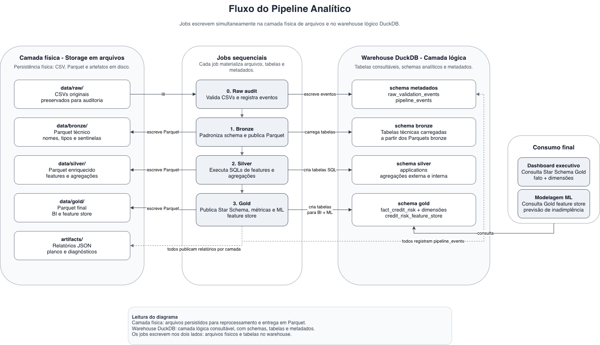

# Pipeline de Análise de Risco

## Contexto

Esse projeto tem como proposta a estruturação de uma camada analítica de risco de crédito que permita que o time de
Produto de Plataforma de Crédito seja capaz de extrair insights dos dados disponíveis de forma fácil e otimizada,
acompanhar métricas importantes para o negócio e facilitar a tomada de decisão embasada em informações reais, bem como
utilizar as bases para criação de modelos estatísticos e análises favoráveis ao negócio.

> **Objetivo principal de negócio:** Obter insights sobre inadimplência

## Estrutura do Projeto

```text
.
├── app/
├── aws/
├── data/
│   ├── raw/
│   ├── bronze/
│   ├── silver/
│   ├── gold/
│   └── warehouse/
├── docs/
├── scripts/
│   ├── execute_pipeline.sh
│   ├── 0_run_raw_ingestion_audit.py
│   ├── 1_run_bronze_transformation.py
│   ├── 2_run_silver_transformation.py
│   └── 3_run_gold_transformation.py
├── sql/
│   ├── silver/
│   └── gold/
├── src/
│   ├── credit_risk_pipeline/
│   │   ├── raw/
│   │   ├── bronze/
│   │   ├── silver/
│   │   └── gold/
│   └── utils/
├── requirements.txt
└── README.md
```

- `app/`: dashboard em Streamlit e funções auxiliares de consulta
- `artifacts/`: relatórios e artefatos gerados pelas execuções das camadas
- `aws/`: proposta de infraestrutura em AWS, incluindo Terraform
- `data/`: armazenamento local das camadas `raw`, `bronze`, `silver`, `gold` e do warehouse DuckDB
- `docs/`: documentação técnica, decisões de modelagem, ingestões e arquivos de referência
- `scripts/`: pontos de entrada para executar cada etapa do pipeline
- `sql/`: transformações SQL versionadas das camadas `silver` e `gold`
- `src/`: código Python do pipeline por camada e utilitários compartilhados



**Observação:** Os itens abaixo seguem a ordem sugerida pelo enunciado do case (1-5).

## 1. Modelagem de Dados

- **Objetivo:** criar uma camada de dados modelada
- A modelagem de dados do projeto é dividida em três camadas principais:
  - CSV em `raw`, preservando os arquivos originais para auditoria, reprodutibilidade e reprocessamento 
  - Parquet em `bronze`, `silver` e `gold`, compondo a camada física do warehouse com melhor performance e estabilidade de schema 
  - Banco DuckDB em `warehouse`, atuando como camada lógica e analítica para exploração, joins, queries, metadados e consumo por negócio/dashboard
- Documentação detalhada: [Decisões de Modelagem](/docs/decisoes_de_modelagem.md).

## 2. Enriquecimento dos Dados (SILVER)

- **Objetivo:** consolidar dados e enriquecê-los para consumo analítico detalhado e histórico, de forma confiável
- Foram criadas features de perfil cadastral, capacidade financeira, comportamento de crédito, atrasos, utilização de
  limite e completude de informações, além de agregações históricas por cliente e contratos anteriores para consolidar
  sinais de risco vindos de bureau, parcelas, cartão de crédito e POS Cash
- Documentação detalhada: [Estruturação da Silver](/docs/ingestao_silver.md)

## 3. Camada de Consumo Analítico (GOLD)

- **Objetivo:** servir como camada de análise do time de negócio, origem de dashboards e base curada para modelagem
  preditiva de inadimplência
- Organizada em modelo dimensional para BI (Star Schema), com fato central de risco de crédito, dimensões de
  solicitante (cliente), contrato e segmento de risco, além de uma feature store de ML com variáveis curadas, one-hot
  encodings e sinais consolidados de capacidade financeira, histórico externo/interno, atraso e completude cadastral
- Documentação detalhada: [Estruturação da Gold](/docs/ingestao_gold.md)

## 4. Dashboard de Insights sobre Inadimplência

O dashboard final com insights pode ser encontrado
em: [Dash de Inadimplência de Crédito](https://home-credit-analytics-case-study.streamlit.app/)

As métricas apresentadas no relatório final mostram a importância da segmentação na análise de risco, e no entendimento
da relevância de cada grupo para priorização de ações. Como, por exemplo, pode-se observar que `Clientes com presença de
 atraso em empréstimos prévios (dentro do mesmo banco) são 57% dos processos inadimplentes, e ainda possuem um risco de
  inadimplência 1.18x maior que o geral da carteira`.

**Observação:** O dashboard publicado consulta a versão final do warehouse diretamente em uma instância
do [MotherDuck](https://motherduck.com/), caso deseje rodar o pipeline manualmente e ativar o dashboard em
uma instância local, pule para o [Item 7](#7-execução-do-pipeline).

## 5. Estrutura sugerida na AWS

Esse projeto foi desenvolvido localmente por ter uma base de dados estática. Nesse cenário, o
provisionamento do pipeline em Cloud AWS é possível, porém com poucos ganhos operacionais. Quando falamos, porém, de uma
estrutura em produção, com ingestão frequente de dados, a estrutura em Cloud se torna indicada e necessária para
manutenção facilitada e auditoria.

- [Arquivo Terraform](/aws/main.tf)
- [Detalhes sobre a proposta](/aws/README.md)

Acesse [Considerações para Produção](/docs/consideracoes.md) para notas em relação a produção e escalabilidade.

## 6. Execução do Pipeline

Para execução desse projeto localmente, siga os passos abaixo.

1. Clone o repositório

```bash
git clone https://github.com/bru-bianchi/home-credit-analytics-case-study.git
cd home-credit-analytics-case-study
```

2. Crie e ative um ambiente virtual, e instale as dependências

```bash
python3 -m venv .venv
source .venv/bin/activate
pip install -r requirements.txt
```

4. Adicione os dados brutos

Baixe os arquivos do
dataset [Home Credit Default Risk](https://www.kaggle.com/competitions/home-credit-default-risk/data) e coloque os CSVs
originais em `data/raw/`.

5. Execute o pipeline local

```bash
chmod +x scripts/execute_pipeline.sh
./scripts/execute_pipeline.sh
```

6. Abra o Dashboard em Streamlit

```bash
streamlit run app/Home.py
```

[OPCIONAL]. Explore o Warehouse localmente

Se desejar explorar as tabelas do warehouse localmente e fazer queries, basta acessar pelo DuckDB UI. Para instalar o 
DuckDB CLI e acessar o DuckDB UI, consulte a documentação oficial: [DuckDB Installation - CLI](https://duckdb.org/install/?platform=macos&environment=cli)

E depois execute:
```bash
~/.duckdb/cli/1.4.4/duckdb data/warehouse/credit_risk.duckdb -ui
```

> **Observação:** Garanta que o warehouse e o dashbaord não estejam abertos localmente em outra sessão do DuckDB enquanto
o pipeline estiver rodando, ou o pipeline trará uma mensagem de erro.
